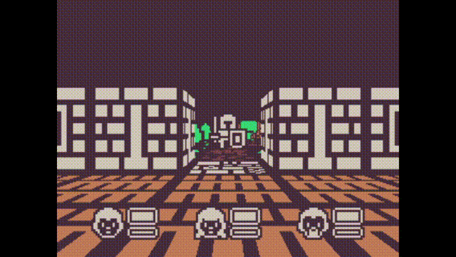

# Devtober 2019



## Install

Lix package manager can easily download all dependencies. My fork must be used though, as official lix doesn't support cloning git submodules.

```
npm install git+https://git@github.com/aidan63/lix.client.git --global
lix download 
```

## Run

```
lix run build run
```

## Post-Mortem

At the beginning of October I set myself two goals, test the usability of the engine I've been working on for the past year or so, and try and produce a small game. I started with a very basic first person, tile based movement demo I created a few months back to test the 3D functionality in the engine. Using [Kenney's](https://kenney.nl/) 1bit rogue like assets the initial plan was to make something similar to Doom RPG, but that quickly changed after trying (and failing) to create some weapon sprites in a similar style. A change was made to switch to entering a traditional turn based rpg battle system. Wanting to do something a bit different in the turn based RPG space, a mood based system was devised. Instead of standard elemental weakness attacks and abilities would effect your parties and enemies mood (agitated, defensive, etc). Different moods would effect the power and weakness to certain attacks as well as change up available actions.

At the end of the month the majority of that did not come to fruition, none of the mood stuff has been implemented, nor have any abilities outside the basic attack, and the enemies can't fight back. Most of this comes down to little work being done in the last week and a bit of October (mostly down to a beer festival followed by illness).

While a finished game wasn't produced I was very happy with how my engine stood up. The game runs fine on all three graphics backends (D3D11, OpenGL 3, and OpenGL 4) and I only had to make one engine bug fix during October. One area I did expect (and was) a bit of a pain was the lack of higher lever constructs, Features like sprites, animations, etc are not currently in my engine, so a fair bit of time was spent manually constructing geometry. The plus side of that is that I now have some of those built (tiled map drawing, nine slice sprites) and they can be rolled into the engine.
Working on a small game (instead of engine work) also finally gave me the excuse to start messing around with ECS. It took a while for it to make sense (still not sure if I'm doing it "correct") but it made it easier to to manage more complex state as more features were added. Definitely something to continue to mess around with.

Devtober was very much worthwhile for me, it validated my engine and gave me pointers for what needs to be improved. Hoping to do another one of these longer game jam-esq things again.